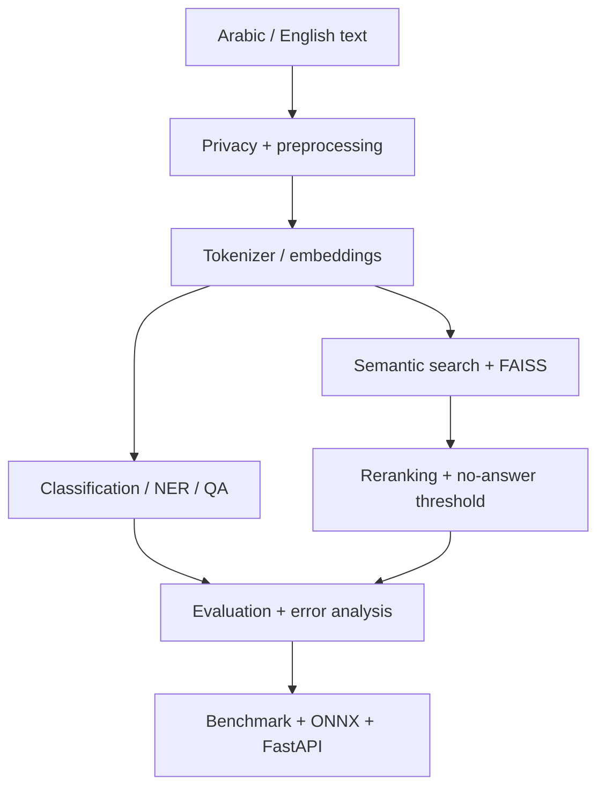

# Bayan — Applied NLP | Haya Albaqami

**Trainee:** Haya Albaqami  
**Repository:** https://github.com/progHYA/Haya-Albaqami-nlp-bayan  
**Course:** Applied Natural Language Processing with Transformers (SDA-AIE-211)  
**Evaluation date:** 2026-09-30

> **Evidence status:** This repository package separates measured course-lab/smoke evidence from project-specific evidence. The attached evaluation explicitly says the course-lab outputs and duplicated `/notebooks` copies were not sufficient as personal project evidence. Therefore, no smoke metric below is presented as a production or final project result.

## Project overview

Bayan is an applied NLP training project covering:

- Arabic/English preprocessing and PII masking
- tokenization and token-level measurements
- scaled dot-product attention and Transformer encoders
- text classification
- NER and extractive QA
- Arabic normalization/profile decisions
- multilingual semantic search with FAISS
- reranking and no-answer thresholding
- evaluation, confidence intervals, slices and error taxonomy
- ONNX export, INT8 quantization and FastAPI serving

The course material describes preprocessing as a versioned data contract and recommends preserving a display copy separately from the model input copy. It also requires project-specific measurement before final claims.

## Architecture



### Attention interpretation

Input text is tokenized, converted to token IDs, mapped to embeddings, and passed through Transformer layers. In self-attention, queries, keys and values are produced from the hidden representations; attention scores are scaled, masked where required, normalized, and used to mix value vectors. Multi-head outputs are then combined and passed through the remaining encoder components.

**Important interpretation boundary:** attention weights describe how the model mixes representations for a particular forward pass. They are not, by themselves, causal explanations of why a prediction occurred.

## Notebooks

| # | Notebook | Colab |
|---|---|---|
| 00 | `00_runtime_doctor.ipynb` | [Open in Colab](https://colab.research.google.com/github/progHYA/Haya-Albaqami-nlp-bayan/blob/main/notebooks/00_runtime_doctor.ipynb) |
| 01 | `01_text_processing_tokenization.ipynb` | [Open in Colab](https://colab.research.google.com/github/progHYA/Haya-Albaqami-nlp-bayan/blob/main/notebooks/01_text_processing_tokenization.ipynb) |
| 02 | `02_attention_transformers.ipynb` | [Open in Colab](https://colab.research.google.com/github/progHYA/Haya-Albaqami-nlp-bayan/blob/main/notebooks/02_attention_transformers.ipynb) |
| 03 | `03_text_classification.ipynb` | [Open in Colab](https://colab.research.google.com/github/progHYA/Haya-Albaqami-nlp-bayan/blob/main/notebooks/03_text_classification.ipynb) |
| 04 | `04_ner_and_qa.ipynb` | [Open in Colab](https://colab.research.google.com/github/progHYA/Haya-Albaqami-nlp-bayan/blob/main/notebooks/04_ner_and_qa.ipynb) |
| 05 | `05_arabic_nlp.ipynb` | [Open in Colab](https://colab.research.google.com/github/progHYA/Haya-Albaqami-nlp-bayan/blob/main/notebooks/05_arabic_nlp.ipynb) |
| 06 | `06_semantic_search.ipynb` | [Open in Colab](https://colab.research.google.com/github/progHYA/Haya-Albaqami-nlp-bayan/blob/main/notebooks/06_semantic_search.ipynb) |
| 07 | `07_evaluation_error_analysis.ipynb` | [Open in Colab](https://colab.research.google.com/github/progHYA/Haya-Albaqami-nlp-bayan/blob/main/notebooks/07_evaluation_error_analysis.ipynb) |
| 08 | `08_optimization_serving.ipynb` | [Open in Colab](https://colab.research.google.com/github/progHYA/Haya-Albaqami-nlp-bayan/blob/main/notebooks/08_optimization_serving.ipynb) |

## Results and evidence

### Current measured smoke/course-fixture evidence

| Area | Metric | Current value | Evidence boundary |
|---|---|---:|---|
| Classification | Validation Macro-F1, baseline | 0.6667 | MEASURED_SMOKE |
| Classification | Validation Macro-F1, Transformer | 1.0000 | MEASURED_SMOKE |
| Classification | Test Macro-F1, Transformer | 0.8667 | MEASURED_SMOKE |
| Classification | Test accuracy | 0.8750 | MEASURED_SMOKE |
| NER | Entity F1 | 0.5714 | MEASURED_SMOKE |
| QA | Training loss | 3.6451 | MEASURED_SMOKE |
| Semantic search | Recall@3 | 1.0000 | MEASURED_SMOKE |
| Semantic search | MRR@3 before reranking | 0.6667 | MEASURED_SMOKE |
| Semantic search | MRR@3 after reranking | 0.7222 | MEASURED_SMOKE |
| Semantic search | Reranking delta | +0.0556 | MEASURED_SMOKE |
| No-answer threshold | Validation accuracy | 1.0000 | MEASURED_SMOKE |
| No-answer threshold | Test no-answer accuracy | 1.0000 | MEASURED_SMOKE |
| Evaluation | Macro-F1 fixture estimate | 0.7819 | COURSE_FIXTURE |
| Evaluation | 95% bootstrap CI | 0.6112–0.8962 | COURSE_FIXTURE |
| Evaluation | Paired difference B−A | +0.0012 | COURSE_FIXTURE; CI crosses 0 |
| Serving | PyTorch model-only p95 | 43.977 ms | SYSTEMS_SMOKE |
| Serving | ONNX FP32 model-only p95 | 27.258 ms | SYSTEMS_SMOKE |
| Serving | INT8 model-only p95 | 11.916 ms | SYSTEMS_SMOKE |
| Serving | FP32 ONNX prediction agreement | 1.0000 | SYSTEMS_SMOKE |
| Serving | INT8 agreement vs FP32 | 0.7500 | SYSTEMS_SMOKE |

### What is still required for a final project claim

The evaluation specifically requires rerunning the relevant notebooks with the student's actual project artefacts and saving the resulting reports. In particular:

1. Use the actual project-trained model and validation data for classification/Arabic evaluation.
2. Record the preprocessing decision, version, Arabic profile and golden tests in `DECISIONS.md`.
3. Compare tokenization choices (including fertility and truncation) on the project data and document the decision.
4. Fill classification Macro-F1, NER entity-F1 and QA no-answer metrics from the project run.
5. For semantic search, save Recall@k and MRR before and after reranking, latency, no-answer threshold and a cross-lingual example.
6. Replace the systems-smoke benchmark with `PROJECT_MODE=True`, the project checkpoint, project tokenizer and full bilingual validation workload.
7. Record p50/p95/p99, throughput, memory, quality tax, ONNX/INT8 parity and the Adopt/Reject/Rollback decision.
8. Measure one project extension and its cost/benefit against baseline.
9. Save validator/preflight reports under `reports/`.

## Reproduction

```bash
python -m pip install -r requirements-day1.txt
PYTHONPATH=src python -m pytest -q tests
python scripts/validate_submission.py .
python scripts/preflight_submission.py . --report reports/preflight.json
```

For Gate D, the optimization notebook must be rerun with `PROJECT_MODE=True`, a real project model/tokenizer, a real validation CSV, and a student-defined budget before candidate measurement.

## Arabic preprocessing decision

The current smoke run used a named `search` profile with:

- preserved display copy
- PII masking
- Unicode normalization without compatibility folding
- removal of tatweel and diacritics
- alef/alef-maqsura folding
- preservation of taa marbuta
- `camel-tools==1.6.0`
- profile version `1.0.0`

This is documented as a **smoke/course-fixture decision**, not a final claim about the best preprocessing for the project.

## My contribution

The project-specific contribution must be tied to concrete files and commits. This package does not invent contribution claims. The supplied evaluation asks for at least one specific change with evidence.

## AI assistance

AI assistance is disclosed as used for documentation/file preparation. It must not be presented as evidence that training or evaluation was completed. The supplied evaluation asks that the tool name be stated explicitly.

## Limitations

The supplied notebook outputs repeatedly identify synthetic/tiny datasets, smoke training, small validation slices and runtime-dependent benchmarks. These results must not be interpreted as production estimates.

## Source attribution

Educational source: `https://github.com/almiyead-rgb/bayan-applied-nlp-course`

The project should preserve the required attribution/license files from the course repository.

# بيان — Bayan Bilingual Applied NLP Project | مشروع بيان لمعالجة اللغة ثنائي اللغة

- **Learner:** Haya Albaqami — هياء البقمي
- **GitHub:** https://github.com/progHYA/Haya-Albaqami-nlp-bayan
- **Final release:** `submission-v1.0`

## Executive Summary | الملخص

مشروع بيان هو خط معالجة لغة طبيعية ثنائي اللغة للعربية والإنجليزية، مع التركيز على النصوص العربية القصيرة واللهجة الخليجية في سياق الخدمات الرقمية.

يبدأ الخط بمعالجة النص وTokenization، ثم Transformer/Attention، وتصنيف النص، وNER، وExtractive QA مع حالة no-answer، ثم البحث الدلالي وإعادة الترتيب، والتقييم وتحليل الأخطاء، وأخيرًا القياس والخدمة.

**البيانات تعليمية/اصطناعية وصغيرة**؛ لذلك لا تمثل النتائج أداءً إنتاجيًا على بيانات مستفيدين حقيقيين.

## What Bayan Does | ماذا يفعل بيان؟

1. **Preprocessing:** معالجة النص العربي والإنجليزي قبل إدخاله للنموذج.
2. **Tokenization:** فحص fertility وtruncation وأساليب الترميز.
3. **Attention & Transformers:** فحص Transformer Encoder وQ/K/V والأقنعة.
4. **Classification:** تصنيف النص باستخدام Transformer مع baseline.
5. **NER:** استخراج الكيانات ومحاذاة BIO وتقييم Entity-F1.
6. **QA:** إجابة استخراجية من السياق مع حالة no-answer.
7. **Semantic Search:** بحث دلالي باستخدام embeddings وFAISS مع reranking.
8. **Evaluation:** مقاييس، شرائح، فترات ثقة، وتحليل أخطاء.
9. **Optimization & Serving:** قياس الأداء وONNX/INT8 واختبارات الخدمة.

## Scope and Limitations | النطاق والحدود

- المشروع تعليمي ومبني على بيانات صغيرة.
- النتائج لا تمثل أداءً إنتاجيًا.
- حجم عينات الاختبار صغير، لذلك يجب تفسير النتائج وفترات الثقة بحذر.
- لا ينبغي استخدام النموذج لاتخاذ قرارات عالية المخاطر عن أشخاص حقيقيين دون تحقق إضافي ومراجعة بشرية.

## Reproduce | إعادة التشغيل

| # | Notebook | Purpose | Evidence |
|---:|---|---|---|
| 00 | `00_runtime_doctor.ipynb` | فحص البيئة | `notebooks/` |
| 01 | `01_text_processing_tokenization.ipynb` | preprocessing وtokenization | `notebooks/` + `reports/` |
| 02 | `02_attention_transformers.ipynb` | attention وTransformer | `notebooks/` + `reports/` |
| 03 | `03_text_classification.ipynb` | classification | `notebooks/` + `reports/` |
| 04 | `04_ner_and_qa.ipynb` | NER وQA | `notebooks/` + `reports/` |
| 05 | `05_arabic_nlp.ipynb` | Arabic NLP | `notebooks/` + `reports/` |
| 06 | `06_semantic_search.ipynb` | semantic search + reranking | `notebooks/` + `reports/` |
| 07 | `07_evaluation_error_analysis.ipynb` | evaluation + error analysis | `notebooks/` + `reports/` |
| 08 | `08_optimization_serving.ipynb` | benchmark + optimization + serving | `notebooks/` + `reports/` |

يفضل تشغيل الدفاتر بالترتيب **00 → 08** وحفظ النسخ المنفذة داخل `notebooks/`.

### Tests and validation

```bash
pip install -r requirements-dev.txt
PYTHONPATH=src python -m pytest -q tests
python scripts/validate_submission.py . --json-report reports/submission_validation.json
python scripts/preflight_submission.py . --report reports/preflight.json
```

> لا تُعتبر نتائج الاختبارات أو تقارير الفحص نهائية إلا إذا كانت الملفات الناتجة محفوظة في `reports/` من التشغيل الفعلي.

## Architecture | المعمارية

```text
Arabic / English text
        |
        v
Preprocessing + Tokenization
        |
        v
Transformer Encoder
        |
   +----+----+----+
   |    |    |    |
   v    v    v    v
Class  NER   QA  Search
              |     |
              |     v
              |   FAISS
              |     |
              |  Reranking
              +-----+
                    |
                    v
        Evaluation + Serving
```

### Attention interpretation

مسار الـTransformer يستخدم self-attention مع masks مناسبة. أوزان attention تصف ما يحسبه رأس attention، لكنها لا تُعامل وحدها كتفسير سببي لقرار النموذج؛ لأن التمثيلات تمر أيضًا عبر residual connections وfeed-forward layers وطبقات أخرى.

## Results | النتائج

> **ملاحظة مهمة:** الأرقام أدناه هي الأرقام التي كانت متاحة في ملفات المشروع السابقة، وبعضها موسوم `MEASURED_SMOKE` أو `COURSE_FIXTURE`. لا ينبغي وصفها بأنها نتائج PROJECT_ARTIFACT إلا إذا كان تقرير التشغيل الأخير يؤكد ذلك.

| Component | Metric | Available result | Evidence |
|---|---|---:|---|
| Classification | Test Macro-F1 | 0.867 `MEASURED_SMOKE` | `reports/classification_results.json` |
| Classification | Test accuracy | 0.875 `MEASURED_SMOKE` | `reports/classification_results.json` |
| NER | Entity-F1 | 0.571 `MEASURED_SMOKE` | `reports/ner_results.json` |
| QA | Valid span example | `الرياض` `MEASURED_SMOKE` | `reports/qa_results.json` |
| QA | No-answer test | PASS `MEASURED_SMOKE` | `reports/qa_results.json` |
| Search | Recall@3 | 1.000 `MEASURED_SMOKE` | `reports/search_results.json` |
| Search | MRR@3 before rerank | 0.667 `MEASURED_SMOKE` | `reports/search_results.json` |
| Search | MRR@3 after rerank | 0.722 `MEASURED_SMOKE` | `reports/search_results.json` |
| Search | MRR@3 delta | +0.056 `MEASURED_SMOKE` | `reports/search_results.json` |
| Evaluation | Macro-F1 estimate | 0.7819 `COURSE_FIXTURE` | `reports/evaluation_report.json` |
| Evaluation | Bootstrap 95% CI | [0.6112, 0.8962] `COURSE_FIXTURE` | `reports/evaluation_report.json` |
| Serving | Arabic/English smoke | PASS `MEASURED_SMOKE` | `reports/serving_project_results.json` |
| Serving | Empty input | 422 `MEASURED_SMOKE` | `reports/serving_project_results.json` |
| Serving | Unsupported language | 422 `MEASURED_SMOKE` | `reports/serving_project_results.json` |

### Benchmark evidence

القياسات المتاحة سابقًا كانت مع `PROJECT_MODE=False`، لذلك لا تُعرض كأداء نهائي لنموذج المشروع حتى يتم التحقق من تشغيل Notebook 08 على artifact المشروع.

- PyTorch p95: **43.977 ms**
- ONNX FP32 p95: **27.258 ms**
- ONNX INT8 p95: **11.916 ms**
- FP32 prediction agreement: **1.00**
- INT8 prediction agreement: **0.75**

## Error Analysis | تحليل الأخطاء

التحليل المتاح سابقًا صنّف الحالات إلى:

- `dialect_gap`: 3
- `hard_or_ambiguous`: 3
- `class_confusion`: 2

الإصلاحات المقترحة:

1. إضافة أمثلة خليجية مستهدفة للصحة والنقل.
2. إضافة أمثلة contrastive للعبارات المتشابهة ومراجعة دليل التسميات.
3. طلب سياق إضافي أو abstain عند انخفاض الثقة في الطلبات القصيرة غير المحددة.

> لا تُوصف هذه الأعداد بأنها أخطاء نموذج المشروع النهائي إلا إذا أكدها تشغيل Notebook 07 الأخير.

## Repository Evidence | أدلة المستودع

- `notebooks/` — دفاتر المشروع 00–08.
- `reports/` — التقارير والنتائج.
- `src/bayan/` — كود المشروع.
- `tests/` — الاختبارات.
- `docs/` — التوثيق.
- `evidence/` — الأدلة الداعمة.
- `BENCHMARKS.md`
- `DECISIONS.md`
- `EVALUATION_REPORT.md`
- `MODEL_CARD.md`
- `DATA_CARD.md`
- `PROGRESS.md`
- `STUDENT_PROFILE.md`
- `PRESENTATION.md`
- `PROJECT_SUMMARY.json`
- `SUBMISSION.yml`

## Release | الإصدار

- **Repository:** `https://github.com/progHYA/Haya-Albaqami-nlp-bayan`
- **Release:** `submission-v1.0`

## Contribution | مساهمتي

تم تنظيم مكونات المشروع، تشغيل الدفاتر، حفظ التقارير والأدلة، وتجهيز المستودع للتقييم النهائي ضمن سياق مشروع Applied NLP.

## AI Assistance | الاستعانة بالذكاء الاصطناعي

تم استخدام أدوات ذكاء اصطناعي للمساعدة في تنظيم الملفات، صياغة بعض التوثيق، ومراجعة متطلبات التقييم. تمت مراجعة المحتوى والنتائج قبل حفظ النسخة النهائية.

> إذا كان التقييم يطلب اسم الأداة تحديدًا، اكتبي اسم الأداة المستخدمة فعليًا بدل هذا السطر العام.

## Responsible Use | الاستخدام المسؤول

المشروع تعليمي، والبيانات صغيرة ومحدودة. لا ينبغي استخدام النظام لاتخاذ قرارات عن أشخاص حقيقيين دون مراجعة بشرية وتحقيق إضافي في الأداء والسلامة.

## Final Validation | الفحص النهائي

يُفضّل حفظ مخرجات الفحص داخل `reports/`:

```text
reports/submission_validation.json
reports/preflight.json
```

ويجب أن يشير `submission-v1.0` إلى الـcommit النهائي الذي يحتوي على الدفاتر والتقارير والاختبارات.

## Training Context | السياق التدريبي

هذا المشروع التعليمي أُنجز ضمن سياق التدريب على معالجة اللغات الطبيعية باستخدام Transformers في أكاديمية سدايا.

#SDAIAAcademy

