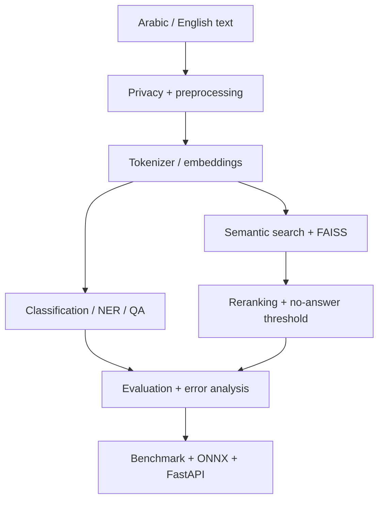

# Bayan — Applied NLP | Haya Albaqami

**Trainee:** Haya Albaqami  
**Repository:** https://github.com/progHYA/Haya-Albaqami-nlp-bayan  
**Course:** Applied Natural Language Processing with Transformers (SDA-AIE-211)  
**Evaluation date:** 2026-09-30

> **Evidence status:** This repository package separates measured course-lab/smoke evidence from project-specific evidence. The attached evaluation explicitly says the course-lab outputs and duplicated `/notebooks` copies were not sufficient as personal project evidence. Therefore, no smoke metric below is presented as a production or final project result.

## Project overview

Bayan is an applied NLP training project covering:

- Arabic/English preprocessing and PII masking
- tokenization and token-level measurements
- scaled dot-product attention and Transformer encoders
- text classification
- NER and extractive QA
- Arabic normalization/profile decisions
- multilingual semantic search with FAISS
- reranking and no-answer thresholding
- evaluation, confidence intervals, slices and error taxonomy
- ONNX export, INT8 quantization and FastAPI serving

The course material describes preprocessing as a versioned data contract and recommends preserving a display copy separately from the model input copy. It also requires project-specific measurement before final claims.

## Architecture



### Attention interpretation

Input text is tokenized, converted to token IDs, mapped to embeddings, and passed through Transformer layers. In self-attention, queries, keys and values are produced from the hidden representations; attention scores are scaled, masked where required, normalized, and used to mix value vectors. Multi-head outputs are then combined and passed through the remaining encoder components.

**Important interpretation boundary:** attention weights describe how the model mixes representations for a particular forward pass. They are not, by themselves, causal explanations of why a prediction occurred.

## Notebooks

| # | Notebook | Colab |
|---|---|---|
| 00 | `00_runtime_doctor.ipynb` | [Open in Colab](https://colab.research.google.com/github/progHYA/Haya-Albaqami-nlp-bayan/blob/main/notebooks/00_runtime_doctor.ipynb) |
| 01 | `01_text_processing_tokenization.ipynb` | [Open in Colab](https://colab.research.google.com/github/progHYA/Haya-Albaqami-nlp-bayan/blob/main/notebooks/01_text_processing_tokenization.ipynb) |
| 02 | `02_attention_transformers.ipynb` | [Open in Colab](https://colab.research.google.com/github/progHYA/Haya-Albaqami-nlp-bayan/blob/main/notebooks/02_attention_transformers.ipynb) |
| 03 | `03_text_classification.ipynb` | [Open in Colab](https://colab.research.google.com/github/progHYA/Haya-Albaqami-nlp-bayan/blob/main/notebooks/03_text_classification.ipynb) |
| 04 | `04_ner_and_qa.ipynb` | [Open in Colab](https://colab.research.google.com/github/progHYA/Haya-Albaqami-nlp-bayan/blob/main/notebooks/04_ner_and_qa.ipynb) |
| 05 | `05_arabic_nlp.ipynb` | [Open in Colab](https://colab.research.google.com/github/progHYA/Haya-Albaqami-nlp-bayan/blob/main/notebooks/05_arabic_nlp.ipynb) |
| 06 | `06_semantic_search.ipynb` | [Open in Colab](https://colab.research.google.com/github/progHYA/Haya-Albaqami-nlp-bayan/blob/main/notebooks/06_semantic_search.ipynb) |
| 07 | `07_evaluation_error_analysis.ipynb` | [Open in Colab](https://colab.research.google.com/github/progHYA/Haya-Albaqami-nlp-bayan/blob/main/notebooks/07_evaluation_error_analysis.ipynb) |
| 08 | `08_optimization_serving.ipynb` | [Open in Colab](https://colab.research.google.com/github/progHYA/Haya-Albaqami-nlp-bayan/blob/main/notebooks/08_optimization_serving.ipynb) |

## Results and evidence

### Current measured smoke/course-fixture evidence

| Area | Metric | Current value | Evidence boundary |
|---|---|---:|---|
| Classification | Validation Macro-F1, baseline | 0.6667 | MEASURED_SMOKE |
| Classification | Validation Macro-F1, Transformer | 1.0000 | MEASURED_SMOKE |
| Classification | Test Macro-F1, Transformer | 0.8667 | MEASURED_SMOKE |
| Classification | Test accuracy | 0.8750 | MEASURED_SMOKE |
| NER | Entity F1 | 0.5714 | MEASURED_SMOKE |
| QA | Training loss | 3.6451 | MEASURED_SMOKE |
| Semantic search | Recall@3 | 1.0000 | MEASURED_SMOKE |
| Semantic search | MRR@3 before reranking | 0.6667 | MEASURED_SMOKE |
| Semantic search | MRR@3 after reranking | 0.7222 | MEASURED_SMOKE |
| Semantic search | Reranking delta | +0.0556 | MEASURED_SMOKE |
| No-answer threshold | Validation accuracy | 1.0000 | MEASURED_SMOKE |
| No-answer threshold | Test no-answer accuracy | 1.0000 | MEASURED_SMOKE |
| Evaluation | Macro-F1 fixture estimate | 0.7819 | COURSE_FIXTURE |
| Evaluation | 95% bootstrap CI | 0.6112–0.8962 | COURSE_FIXTURE |
| Evaluation | Paired difference B−A | +0.0012 | COURSE_FIXTURE; CI crosses 0 |
| Serving | PyTorch model-only p95 | 43.977 ms | SYSTEMS_SMOKE |
| Serving | ONNX FP32 model-only p95 | 27.258 ms | SYSTEMS_SMOKE |
| Serving | INT8 model-only p95 | 11.916 ms | SYSTEMS_SMOKE |
| Serving | FP32 ONNX prediction agreement | 1.0000 | SYSTEMS_SMOKE |
| Serving | INT8 agreement vs FP32 | 0.7500 | SYSTEMS_SMOKE |

### What is still required for a final project claim

The evaluation specifically requires rerunning the relevant notebooks with the student's actual project artefacts and saving the resulting reports. In particular:

1. Use the actual project-trained model and validation data for classification/Arabic evaluation.
2. Record the preprocessing decision, version, Arabic profile and golden tests in `DECISIONS.md`.
3. Compare tokenization choices (including fertility and truncation) on the project data and document the decision.
4. Fill classification Macro-F1, NER entity-F1 and QA no-answer metrics from the project run.
5. For semantic search, save Recall@k and MRR before and after reranking, latency, no-answer threshold and a cross-lingual example.
6. Replace the systems-smoke benchmark with `PROJECT_MODE=True`, the project checkpoint, project tokenizer and full bilingual validation workload.
7. Record p50/p95/p99, throughput, memory, quality tax, ONNX/INT8 parity and the Adopt/Reject/Rollback decision.
8. Measure one project extension and its cost/benefit against baseline.
9. Save validator/preflight reports under `reports/`.

## Reproduction

```bash
python -m pip install -r requirements-day1.txt
PYTHONPATH=src python -m pytest -q tests
python scripts/validate_submission.py .
python scripts/preflight_submission.py . --report reports/preflight.json
```

For Gate D, the optimization notebook must be rerun with `PROJECT_MODE=True`, a real project model/tokenizer, a real validation CSV, and a student-defined budget before candidate measurement.

## Arabic preprocessing decision

The current smoke run used a named `search` profile with:

- preserved display copy
- PII masking
- Unicode normalization without compatibility folding
- removal of tatweel and diacritics
- alef/alef-maqsura folding
- preservation of taa marbuta
- `camel-tools==1.6.0`
- profile version `1.0.0`

This is documented as a **smoke/course-fixture decision**, not a final claim about the best preprocessing for the project.

## My contribution

The project-specific contribution must be tied to concrete files and commits. This package does not invent contribution claims. The supplied evaluation asks for at least one specific change with evidence.

## AI assistance

AI assistance is disclosed as used for documentation/file preparation. It must not be presented as evidence that training or evaluation was completed. The supplied evaluation asks that the tool name be stated explicitly.

## Limitations

The supplied notebook outputs repeatedly identify synthetic/tiny datasets, smoke training, small validation slices and runtime-dependent benchmarks. These results must not be interpreted as production estimates.

## Source attribution

Educational source: `https://github.com/almiyead-rgb/bayan-applied-nlp-course`

The project should preserve the required attribution/license files from the course repository.
